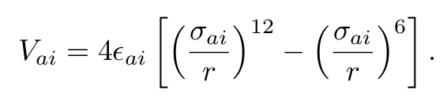
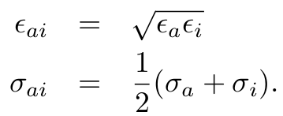

PEGrid
======

This Julia package is for analyzing nanoporous materials for gas adsorption using classical force fields. It has the following capabilities:

* writes grids of the potential energy of an adsorbate molecule in the material in a Gaussian cube format (file extension: .cube) With this .cube energy grid file, we can visualize the potential energy contours of the adsorbate inside the pores of the crystal as in the figure below.

<a href="url"></a>

* Computing the potential energy of an adsorbate at a particular position/configuration in the structure

* Compute Henry constants

* Given snapshots of adsorbate positions from a Grand-canonical Monte Carlo simulation, PEGrid can bin adsorbate positions and store them in volume files for visualizing probability density functions of adsorbate locations.

* Replicating the unit cell of a .cssr file

* Compute the crystal density and irreducible chemical formula of a nanoporous material

## Necessary data

PEGrid requires as input the structure of the nanoporous material and the force field parameters used to model the energy of the interactions between an adsorbate molecule and the atoms of the material.

### `data/structures/` for crystal structures
Put the crystal structure files in .cssr format here. The popular .cif format can be converted to .cssr using [Zeo++](http://www.maciejharanczyk.info/Zeopp/):
    
    ./network -cssr ${yourstructurename}.cif

You can play with a framework object by:

```Julia
framework = Framework("IRMOF-1")  # load IRMOF-1.cssr
framework.a  # length of crystal axis a
framework.alpha  # angle in unit cell
framework.natoms  # number of atoms in unit cell
framework.atoms  # list of atoms
framework.fractional_coords  # array of corresponding ractional coords

framework.chemicalformula()  # get chemical formula
framework.crystladensity()  # get crystal density (kg/m3)
```

### `data/forcefields/` for force field

The force field is the model and parameters used to describe the potential energy of the adsorbate molecule with the atoms of the crystal structure. PEGrid models the interaction between the adsorbate *a* and crystal structure atom type *i* a distance *r* apart with the Lennard-Jones potential:

<a href="url"></a>

Currently, only adsorbates modeled as a Lennard-Jones sphere are supported; electrostatic charges and more complex molecules are not yet supported.

The Lennard-Jones parameters for the cross-interaction between adsorbate *a* and atom type *i* are computed from the pure *a-a*, *i-i* interactions using the following Lorenz-Berthelot mixing rules:

<a href="url"></a>

The pure *i-i* and *a-a* Lennard-Jones interaction parameters must be stored in `data/forcefields/${yourforcefield}.csv`.

We mimic an infinite crystal by applying periodic boundary conditions. This is enabled by approximating interactions beyond a cutoff radius to be zero. The cutoff radius, technically part of the force field, is provided as an argument in the functions of PEGrid.

You can play with a forcefield object:

```Julia
forcefield = Forcefield("UFF", "Xe")  # construct forcefield for Xe using UFF
forcefield.atoms  # atoms in FF that interact with Xe
forcefield.epsilon  # corresponding Lennard-Jones epsilons
forcefield.sigma  # corresponding Lennard-Jones sigmas
```

### `data/atomicmasses.csv` for storing atomic masses of the [psuedo-]atoms 

In order to calculate the crystal density of the framework and center of mass of a complicated adsorbate molecule, PEGrid stores the atomic masses (units: amu) of the atoms in `data/atomicmasses.csv`. We say "pseudo-atom" because e.g. two CH<sub>2</sub> beads are used to model ethene.

### `data/adsorbates/` for adsorbate molecule information

As an example, ethene, which we name 'CH2CH2' consists of two 'CH2' beads with a bond length of 1.33 A:

    Adsorbate: CH2CH2
    Number_of_beads: 2
    Bead_names: CH2 CH2
    Bead_positions.csv:
    x,y,z
    0,0,0
    1.33,0,0

The adsorbate molecule will automatically be translated to coordinates such that the origin is at the center of mass, so do not fret about the non-uniqueness of coordinate definitions. You can play with your adsorbate by:

```Julia
ethene = Adsorbate("CH2CH2")
ethene.nbeads # get number of beads
ethene.get_MW() # get molecular weight
ethene.bead_xyz # look at Cartesian positions of beads
ethene.translate([1.0, 1.0, 1.0])  # translate adsorbate by Cartesian vector [1.0, 1.0, 1.0]
ethene.set_origin_at_COM()  # translate back to center of mass
ethene.perform_uniform_random_rotation()  # perform a uniformly rotation of the adsorbate
```
## Requirements

PEGrid requires the `DataFrames` and `Optim` packages in Julia. To install, type in Julia: `Pkg.add("DataFrames")`.

## How to write the grid

Start up Julia by typing `julia` into the terminal.

PEGrid computes the potential energy grid in both a serial implementation as well as a parallel implementation that fully utilizes the cores on your computer (much faster! [Blog post](http://mathemathinking.com/uncategorized/parallel-monte-carlo-in-julia/)).

As an example, say we want to use the `UFF` forcefield to compute the energy of adsorbate molecule `CH4` (modeled as a Lennard-Jones sphere) in crystal structure `IRMOF-1` using a Lennard-Jones cutoff of 12.5 Angstrom on a 3D grid of points with a spacing of 1.0 Angstrom.

### Serial implementation

The following two lines of code in Julia will write a .cube grid file (units: kJ/mol) to your home directory.

```Julia
include("src/energygrid.jl")
writegrid("CH4", "IRMOF-1", "UFF", gridspacing=1.0, cutoff=12.5)
```

* `CH4`: corresponds to an atom listed in data/forcefields/UFF.csv
* `IRMOF-1`: corresponds to crystal structure file data/structures/IRMOF-1.cssr

The code will print off the progress of the grid writing every 10%. Be patient, as computing fine grids and/or large unit cells lead to long computation times.

### Parallel implementation

Check how many cores you have on your computer by typing in the terminal:

    cat /proc/cpuinfo | grep processor | wc -l

We can speed up the computation of the energy grid by assigning each core on your computer a sheet of the energy grid to compute in parallel. To do this, start up Julia by telling it how many additional cores you want to utilize. For example, if you have 8 cores, start Julia in the termial using:
    
    julia -p 7

Then the following two lines of code will compute the energy grid in parallel:

```Julia
include("src/parallelenergygrid.jl")
parallel_writegrid("CH4", "IRMOF-1", "UFF", gridspacing=1.0, cutoff=12.5)
```

You should observe a significant speed up in comparison to the serial implementation.

## How to visualize potential energy contours with the grid

Use the VisIt visualization tool. Generate an .xyz file of the crystal structure, a .vtk file that represents the unit cell boundary, and a .cube file of the energy grid (all can be done using PEGrid). These will be stored in `$HOME/PEGrid_output`. You can generate a VisIt script to make a visualization of the `CH4` grid for `IRMOF-1` using PEGrid by calling:

```Julia
include("src/generate_visit_script.jl")

generate_visit_script("IRMOF-1", "CH4")
```

This will generate a VisIt script `IRMOF-1_CH4_visit_script.visit`. You can copy and paste this into the VisIt command line by, after opening VisIt, going to Controls--> Command. VisIt should automatically open your files generated by PEGrid and show the crystal structure and unit cell boundary. You can modify the contour plot as you choose by double clicking on the contour plot in the Plots window of VisIt.

## Other features

#### Estimate 3D probability density function of adsorbate positions in a material

Say we have a .xyz file of positions of adsorbate molecules in the material from a Grand-canonical Monte Carlo simulation. Plotting the adsorbates as points is not very informative, since it is difficult to see the density of points-- especially as the number of snapshots gets large, which gives better statistical quality. PEGrid can partition the space of the unit cell into voxels and count the number of adsorbates that fall in each voxel. PEGrid stores this normalized probability density estimation in a Gaussian cube file to visualize as a cloud with a volume plot. e.g. VisIt can make volume plots.

Put your .xyz file of adsorbate positions in the main directory, named `adsorbate_positions_$structurename.xyz`.

If we want to visualize the density of `Kr` adsorbates in the material `IRMOF-1`, we use the following Julia code:

```Julia
include("src/positiondistn.jl")

writeprobabilitydistncube("IRMOF-1", "Kr", 0.5)
```

The last argument gives the aim of widths in A for each bin along the a, b, and c axes of the crystal.

This will write a .cube file of the adsorbate probability density in `$home/PEGrid_ouptut/$structurename_adsorbate_probability_distn.cube`.

#### Replicating a .cssr to an .xyz file

An .xyz file contains a list of atoms in the crystal structure file, their identities, and their positions in Cartesian coordinates. An .xyz file is useful for visualizing the atoms of the crystal structure. PEGrid can replicate the unit cell of the crystal in each direction, so that the 'home' unit cell is in the center, and output a .xyz of the replicated crystal structure file.

The function `replicate_cssr_to_xyz` will replicate the unit cell of the crystal and save an .xyz file in the current directory (just above the `data` folder).

```Julia
include("src/framework.jl")
replicate_cssr_to_xyz(${yourstructurename})
```

The function `replicate_cssr_to_xyz(structurename::String; rep_factor::Int=1)` takes an additional, optional argument `rep_factor` which is the number of times we desire to replicate the unit cell in the .cssr file.

#### Computing the density and chemical formula of a crystal structure

First create a `Framework` type, which reads the crystal coordinates, atomic identities, and unit cell sizes from the crystal structure file:

```Julia
include("src/framework.jl")
framework = Framework("${yourstructurename}")
```

Then, call the attribute function `crystaldensity()` of the framework object to get the crystal density.

```Julia
rho = framework.crystaldensity()
```

This returns the crystal density of the framework (units: kg/m3).

To get the chemical formula,

```Julia
framework.chemicalformula()
```

#### Generating a .vtk mesh file of edges of unit cell 

The .vtk mesh file allows us to visualize the boundaries of the unit cell. To generate a .vtk of the unit cell boundary, use the following Julia code:

```Julia
include("src/framework.jl")
write_unitcell_boundary_vtk("${yourstructurename}")
```

The .vtk file `${yourstructurename}.vtk` will be written in the working directory (just above the `data` directory).

#### Computing the potential energy of an adsorbate at an array of [fractional] points

e.g., to compute the potential energy of adsorbate `CH4` in crystal structure `IRMOF-1` using Lennard-Jones parameters in `data/forcefield/UFF.csv` with a cutoff radius of 12.5 at a set of *fractional* coordinates `(x_f, y_f, z_f)`:

```Julia
include("src/energyutils.jl")

fractional_coord = [.2, .1, .5]
E = E_vdw_at_points("IRMOF-1", "UFF", "CH4", fractional_coord, cutoff=12.5)
# returns energy at fractional coordinate [.2, .1, .5]

fractional_coords = [.2 .3; .1 .4; .5 .8]
E = E_vdw_at_points("IRMOF-1", "UFF", "CH4", fractional_coords, cutoff=12.5)
# returns array of energies corresponding to fractional points [.2, .1, .5] and [.3, .4, .8]
```

This will return the energy of the adsorbate at that fractional coordinate (units: Kelvin).

- [ ] include function to convert from Cartesian to fractional for this function

Cheers to Watson Research Scientist [Richard Luis Martin](https://www.linkedin.com/in/richardluismartin) for generally teaching me to store the grid and make these visualizations.
